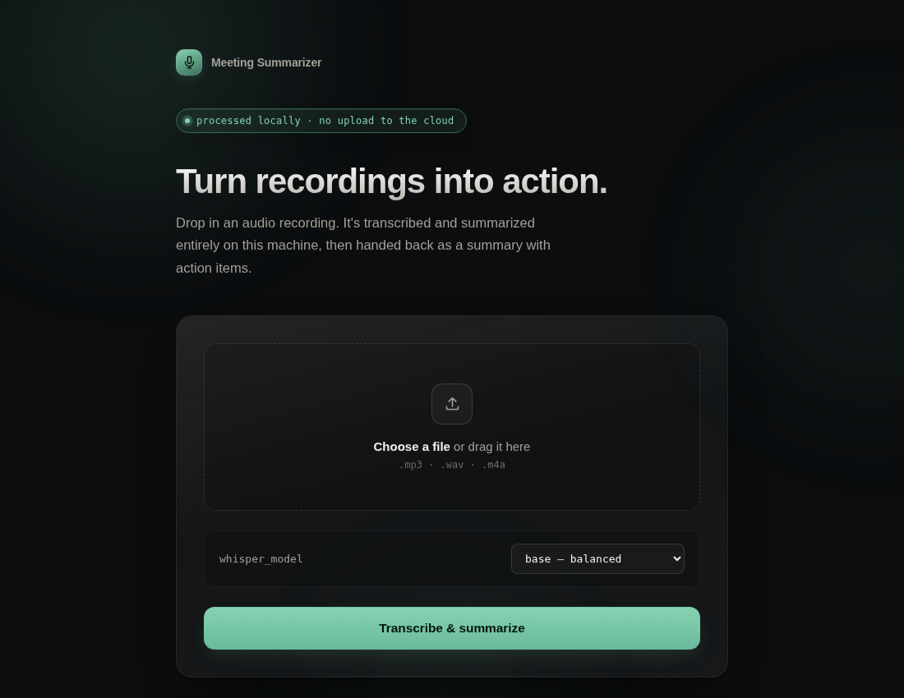

# Meeting Summarizer

A fully local tool that turns audio recordings (meetings, lectures, voice
memos) into a clean summary with extracted action items - no API keys, no
cloud services, no data leaving your machine.

It uses [OpenAI's Whisper](https://github.com/openai/whisper) for speech-to-text
and a local extractive summarization algorithm for the summary, so everything
runs offline on your own CPU. Comes with both a command-line tool and a
local web interface.



## What it does

```
audio file (.mp3 / .wav / .m4a)
        │
        ▼
  Whisper (local)  ───►  full transcript + detected language
        │
        ▼
  Summarizer       ───►  summary + action items
        │
        ▼
  Downloads        ───►  transcript.txt  +  full report.pdf
```

Given an audio file, the web interface gives you:

- A short summary of the key points
- A checklist of detected action items
- The full transcript, viewable inline or downloaded as a `.txt` file
- A formatted **PDF report** (summary + action items + transcript) for sharing
- The **automatically detected language** of the recording, shown next to the result

The CLI pipeline produces the same transcript and summary as a Markdown
report (see "Command-line pipeline" below).

## Features

- **Fully local and private** - no internet connection or API key required
  once the Whisper model is downloaded
- **Two ways to use it** - a one-command CLI pipeline, or a local web
  interface for drag-and-drop uploads
- **Multi-language** - Whisper auto-detects the spoken language; the
  transcript, summary, and downloadable PDF are produced in that language
- **Downloadable in two formats** - plain `.txt` transcript, or a full
  formatted PDF report (summary + action items + transcript)
- **Configurable** - choose the Whisper model size, summary length, and
  output location
- **Tested** - core logic covered by a pytest suite
- **Dockerized** - run the web interface with a single `docker compose up`,
  no local Python setup required

## Running with Docker (recommended for the web interface)

The easiest way to run the web interface - no need to install Python,
ffmpeg, or any dependencies on your machine.

```bash
docker compose up --build
```

Then open **http://localhost:5050** in your browser. Upload an audio file,
choose a Whisper model size, and click "Transcribe & summarize."

> The container listens on port 5000 internally, mapped to **5050** on
> your machine by default (`docker-compose.yml`). On macOS, port 5000 is
> often already taken by AirPlay Receiver, so 5050 is used to avoid that
> conflict. Change the host-side port in `docker-compose.yml` if you'd
> like to use something else.

Generated transcripts and reports are saved to `output/` on your host
machine (mapped via a volume), so they persist even after the container
stops. The Whisper model is cached in a Docker volume, so it's only
downloaded once.

To stop it:
```bash
docker compose down
```

## Running locally without Docker

Requires Python 3.10+ and [ffmpeg](https://ffmpeg.org) (used by Whisper to
decode audio).

```bash
# Clone the repository
git clone https://github.com/yahyahani/meeting-summarizer.git
cd meeting-summarizer

# Install ffmpeg (macOS)
brew install ffmpeg

# Create and activate a virtual environment
python3 -m venv venv
source venv/bin/activate   # on Windows: venv\Scripts\activate

# Install dependencies
pip install -r requirements.txt
```

### Web interface

```bash
python3 app.py
```

Open **http://127.0.0.1:5000** in your browser.

### Command-line pipeline

Run the full pipeline on an audio file:

```bash
python3 src/pipeline.py sample_audio/meeting.m4a
```

This will:
1. Transcribe the audio locally with Whisper
2. Summarize the transcript
3. Extract action items
4. Save a Markdown report to `output/`

#### Options

| Flag | Default | Description |
|---|---|---|
| `--model` | `base` | Whisper model size: `tiny`, `base`, `small`, `medium`, `large`. Bigger = more accurate, slower, more RAM. |
| `--sentences` | `5` | Number of sentences to include in the summary. |
| `--output-dir` | `output` | Directory where the transcript and report are saved. |
| `--keep-transcript` / `--no-keep-transcript` | `--keep-transcript` | Whether to also save the raw transcript as a `.txt` file. |

Example with a larger, more accurate model:

```bash
python3 src/pipeline.py sample_audio/meeting.m4a --model small --sentences 8
```

See all options:

```bash
python3 src/pipeline.py --help
```

### Running stages individually

The pipeline is built from two independent stages, which can also be run on
their own:

```bash
# Stage 1: audio -> transcript only
python3 src/transcribe.py sample_audio/meeting.m4a

# Stage 2: transcript -> summary + action items
python3 src/summarize.py output/meeting_transcript.txt
```

## Running the tests

```bash
python3 -m pytest tests/ -v
```

The test suite covers summarization, action-item extraction, report
building, PDF generation (including Arabic and Chinese rendering), and
the Flask app's validation/cleanup logic. It runs fully offline in a few
seconds, since it doesn't depend on Whisper or real audio files.

## Design

The web interface uses a dark, glass-surface design system meant to feel
calm and trustworthy rather than like a generic cloud SaaS dashboard - the
visual language reinforces that everything happens locally:

- A pulsing "processed locally · no upload to the cloud" badge, always visible
- Soft ambient gradients drifting slowly in the background
- Frosted-glass cards (`backdrop-filter: blur`) with subtle depth and glow
- A metric strip on the results page (word count, recording length, action
  items found) for an at-a-glance summary

All styling lives in `static/style.css` as plain CSS custom properties -
no build step, no framework, easy to re-theme by editing the variables at
the top of the file.

## Language support

Whisper automatically detects the spoken language from the audio itself -
this isn't a setting you choose, it's identified during transcription. The
transcript, summary, and PDF report are all produced in that same
language (Whisper transcribes, it doesn't translate).

The detected language is shown as a badge next to the result in the web
interface (e.g. "English", "Arabic", "Chinese").

PDF generation uses a font appropriate for the detected script:

| Script | Languages (examples) | Font used |
|---|---|---|
| Latin / Cyrillic / Greek | English, Dutch, French, German, Spanish, Russian, Polish, Greek, ... | Noto Sans |
| Arabic | Arabic, Persian, Urdu | Noto Sans Arabic (with correct right-to-left reshaping) |
| CJK | Chinese, Japanese, Korean | Noto Sans SC |

Arabic-script text is reshaped and reordered with `arabic-reshaper` and
`python-bidi` before rendering, so letters connect properly and the text
flows right-to-left as expected - ReportLab does not do this automatically.

## Downloads

From the web interface results page, two downloads are available:

- **`transcript.txt`** - the raw transcript, plain text
- **`full report.pdf`** - a formatted PDF containing the summary, the
  action item checklist, and the full transcript, using the appropriate
  font for the detected language

Both are generated on the fly and saved to `output/` on the host machine
(when running via Docker, this is mapped as a volume so files persist
after the container stops).

## Reliability and safety

A few things the web interface does to stay stable under real use:

- **Upload size limit** - files over 200MB are rejected before being read
  into memory (`MAX_CONTENT_LENGTH` in `app.py`)
- **Automatic cleanup** - files in `uploads/` and `output/` older than 24
  hours are removed at the start of each request, so disk usage doesn't
  grow unbounded with repeated local use
- **Input validation** - the Whisper model selection is validated against
  a fixed allow-list server-side (not just trusted from the form), empty
  files are rejected, and silent/no-speech recordings get a clear message
  instead of an empty result
- **No leaked internals** - if transcription fails, the user sees a plain
  error message; the actual exception is logged server-side, never shown
  in the response
- **Debug mode is off by default** - Flask's debug mode (which exposes an
  interactive debugger and full stack traces) must be explicitly enabled
  via `FLASK_DEBUG=true`, rather than being on by default
- **PDF generation failures don't lose your transcript** - if building the
  PDF report fails for any reason, the page still shows the transcript and
  summary; only the PDF download is skipped

## Project structure

```
meeting-summarizer/
├── src/
│   ├── transcribe.py   # Stage 1: audio -> text + language detection (Whisper)
│   ├── summarize.py    # Stage 2: text -> summary + action items
│   ├── pdf_report.py   # Builds the downloadable PDF report (multi-language)
│   └── pipeline.py     # CLI entry point combining transcription + summarization
├── templates/          # HTML templates for the web interface
│   ├── index.html
│   └── results.html
├── static/
│   ├── style.css       # Web interface design system
│   └── fonts/          # Bundled Unicode fonts for PDF generation
│       ├── NotoSans-Regular.ttf        # Latin / Cyrillic / Greek
│       ├── NotoSansArabic-Regular.ttf  # Arabic
│       └── NotoSansSC-Regular.ttf      # Chinese / Japanese / Korean
├── app.py              # Flask web interface
├── tests/
│   ├── test_transcribe.py
│   ├── test_summarize.py
│   ├── test_pdf_report.py
│   └── test_app.py
├── sample_audio/       # put your audio files here
├── output/             # generated transcripts, PDFs, and reports land here
├── uploads/            # temporary storage for web-uploaded files
├── conftest.py         # pytest path configuration
├── Dockerfile
├── docker-compose.yml
├── LICENSE
└── requirements.txt
```

## How action items are detected

Action items are found using pattern matching on common task/commitment
phrases (e.g. "need to", "follow up with", "by Friday", "deadline"), rather
than a separate AI model. It's intentionally simple, fast, and fully
transparent - you can see exactly why a sentence was flagged by checking
`ACTION_PATTERNS` in `src/summarize.py`.

## Notes on accuracy

Transcription quality depends on the Whisper model size and audio quality.
The default `base` model is fast but can struggle with background noise or
unclear audio. If your transcripts come out garbled, try a larger model:

```bash
python3 src/pipeline.py sample_audio/meeting.m4a --model medium
```

The same `--model` choice is available as a dropdown in the web interface.

## License

MIT
